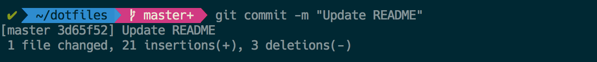

## Installation

Start by cloning the repo:

```
git clone https://github.com/livathinos/dotfiles
```

Assumes that this is cloned to `~/dotfiles`.

Run `boostrap` to get going. Any file with a `.link` extension will get
symlinked to a dotfile in your home directory with same name.

Files that are already there can be skipped (with the `s` option). You will be
seeing output like this when running `bootstrap`.

```
./bootstrap

  [ OK ] skipped /Users/spyros/dotfiles/ack/ackrc.link
  [ OK ] skipped /Users/spyros/dotfiles/ag/agignore.link

...

  [ OK ] done installing vim
  [ OK ] done setting up iterm
  [ OK ] done installing fonts

  All installed!
```

## Setting up vim

In order to install all plugins, you will need to run `:PluginInstall` the first
time you open up vim.

## Setting up bash powerline

The end result looks like this:


1. Install a version of bash > 4. Using homebrew:
  ```
  brew install bash
  sudo /etc/shells << <bash_installation_path>
  chsh
  ```
  where `bash_installation_path` is something like
  `/usr/local/Cellar/bash/4.x.x/bin/bash`.

2. iTerm -> Preferences -> Colors -> Load Presets -> Import and import the
   `Dark.itermcolors` file from `dotfiles/iterm/`
